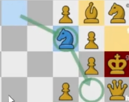

# Rules
Protocol based on generally accepted chess rules with minor clarifications and differences
- No build in alliances, free for all
- En passant disallowed?

# Proto TODO
- [ ] Out of game session
  - [ ] Register players inqueue
- [ ] Active game session
  - [ ] Reconnect back to active game session on connection lost
  - [ ] Basic move
  - [ ] Special move
    - [ ] Promotion
    - [ ] En Passant
    - [ ] Castling
  - [ ] Player timer
  - [ ] Drawing like this  
  
 
